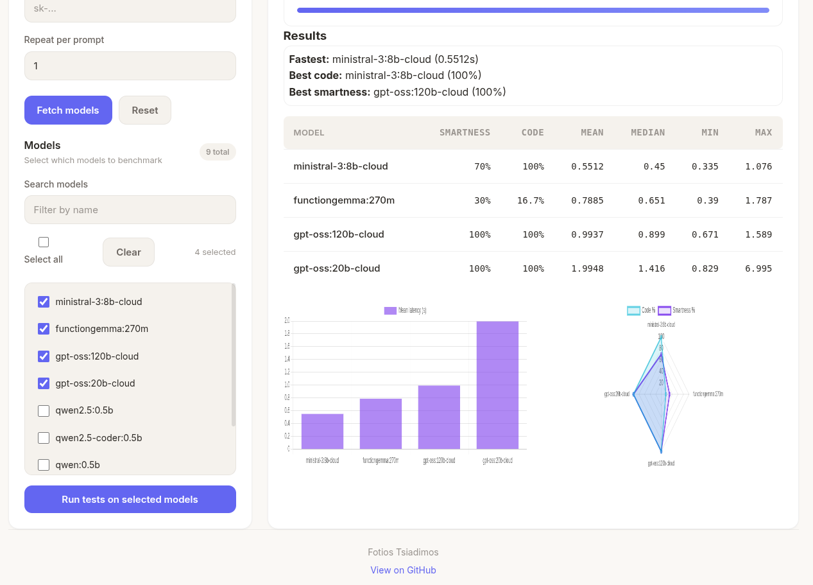

# 🧠 Ollama IQ Model Tester ✅

Ollama - Benchmark your local LLM models, finds models, measures per-prompt latency, and runs lightweight "smartness" and code-skill checks.

---

## 📸 Screenshot

<div align="center">
  <div style="display:inline-flex;gap:8px;margin-bottom:12px;flex-wrap:wrap;justify-content:center">
    <span style="display:inline-flex;align-items:center;gap:8px;padding:6px 10px;border-radius:999px;background:#ffffff;border:1px solid #eee;color:#333;font-weight:600">🧠 Smartness</span>
    <span style="display:inline-flex;align-items:center;gap:8px;padding:6px 10px;border-radius:999px;background:#ffffff;border:1px solid #eee;color:#333;font-weight:600">💻 Code</span>
    <span style="display:inline-flex;align-items:center;gap:8px;padding:6px 10px;border-radius:999px;background:#ffffff;border:1px solid #eee;color:#333;font-weight:600">⚡ Latency</span>
    <span style="display:inline-flex;align-items:center;gap:8px;padding:6px 10px;border-radius:999px;background:#ffffff;border:1px solid #eee;color:#333;font-weight:600">📊 Charts</span>
    <span style="display:inline-flex;align-items:center;gap:8px;padding:6px 10px;border-radius:999px;background:#ffffff;border:1px solid #eee;color:#333;font-weight:600">🗂️ History</span>
  </div>

  <a href="mis/image.png" target="_blank">
    
  </a>
  <div style="margin-top:8px;color:#6b6b6b;font-size:0.95rem"><em>Dashboard overview</em></div>
</div>

---

## ✨ What's new
- Redesigned UI with a warm, modern look and improved spacing for readability
- Theme options: **Light**, **Dark**, and **Warm Dark** (switch in the header)
- New **About** page describing the tests, developer, and tech stack
- Cleaner footer and improved accessibility and responsiveness

---

## 🔧 Features
- Discover models on an Ollama server (local or remote)
- Auto-filter models containing `etch` (configurable)
- Measure latency (repeatable runs) and compute simple statistics
- Heuristic "smartness" checks and basic code-skill scoring (sandboxed subprocess)
- Interactive web UI with charts, live progress, and saved run history
- Save / download past runs (SQLite)

---

## 🚀 Quickstart — Docker (recommended)
Run the official image exposing the default app port (9912):

#### Pull and run in one command

```bash
docker run -d \
  --name ollamaiq \
  -p 9912:9912 \
  ftsiadimos/ollamaiq
```

Open http://localhost:9912


Or with Docker Compose (example):

```yaml
version: '3.8'
services:
  ollamaiq:
    image: ftsiadimos/ollamaiq
    container_name: ollamaiq
    ports:
      - "9912:9912"
    restart: unless-stopped
```

Start it:

```bash
docker-compose up -d
```

The service listens on port **9912** by default.

---

## 💻 Local install (development)
1. Create and activate a virtual environment (recommended):

```bash
python -m venv venv
source venv/bin/activate
```

2. Install dependencies:

```bash
pip install -r requirements.txt
```

3. Run the web UI:

```bash
# Option A (run directly - dev):
python app.py

# Option B (Flask runner):
export FLASK_APP=app
flask run --host=127.0.0.1 --port=9912

# Option C (production-like using Gunicorn):
# gunicorn -w 1 --threads 4 -b 0.0.0.0:9912 app:app
```

Visit http://127.0.0.1:9912

Environment variables:
- `OLLAMA_DEFAULT_HOST` — default host shown in the UI (e.g. `http://localhost:11434`)
- `OLLAMA_API_KEY` — optional API key for cloud access
- `FLASK_RUN_HOST` / `FLASK_RUN_PORT` — override host/port when running Flask (default 9912)

---

## 🧪 About the tests
- **Code Generation:** accuracy of generated code for programming prompts
- **Smartness:** heuristic score across reasoning and puzzle-like prompts
- **Latency:** mean/median/min/max response times per prompt

See the **About** page in the UI for more details and tips for getting reproducible results.

---

## ⚠️ Security & Notes
- Code-skill tests run in a sandboxed subprocess with conservative limits; this reduces risk but is not a full sandbox. For production, consider stronger isolation (containers, dedicated sandboxes).
- The smartness scoring is heuristic and intended for quick comparisons, not formal benchmarking.

---

## 🤝 Contributing
Contributions are welcome! Please open an issue or pull request. If you add tests, update CI to run them.

---

## 📄 License
MIT — see the repository LICENSE file for details.
